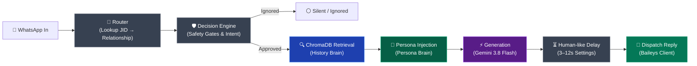

# 🚗 WhatsApp on Cruise Control

> **Hands-Free Autonomous Replies by a Retrieval-Grounded Persona Agent**

WhatsApp on Cruise Control is a retrieval-grounded WhatsApp persona agent, not a generic chatbot. It combines a persona prompt ("who you are") with a ChromaDB vector store of your actual past conversations ("how you reply") to synthesize authentic, in-character responses. Before speaking, the agent evaluates every message through multi-layered safety gates, intent checks, and an independent allowlist to ensure it only replies when appropriate.

---

## ⚠️ USE RESPONSIBLY

> [!CAUTION]
> **Safety & Terms of Service Guidelines**
>
> - **Terms of Service**: Baileys automates WhatsApp Web protocol, which is against WhatsApp's official Terms of Service.
> - **Dedicated Number Required**: Run this project **only on a dedicated or secondary WhatsApp number** — **never** link your primary personal or critical business number.
> - **Consent**: Reply only to consenting contacts (friends, family, or test contacts who have explicitly agreed to test your agent).
> - **Rate & Volume Limits**: Keep message volume low and maintain randomized human-like delays (minimum 3–12 seconds).
> - **Ban Risk**: Aggressive, bulk, or unattended automation can result in your WhatsApp account being permanently banned by WhatsApp anti-spam systems.

---

## 🧠 Two-Brain Architecture

The agent operates on an 8-stage pipeline separating tone and identity from conversational memory:



### Pipeline Overview

1. **Message In**: Real incoming WhatsApp messages captured in real time via Baileys (`messages.upsert` with `type: "notify"`).
2. **Router**: Deterministic table lookup ([config/relationship_map.json](config/relationship_map.json)) mapping contacts to `friend`, `family`, `professional`, `group`, or `unknown`.
3. **Decision Engine**: Multi-stage safety checks:
   - *Hard Rules*: Ignore own messages, unknown senders, and unallowlisted group chats.
   - *Signal Rules*: Acknowledge media-only items (`image`, `audio`, `video`) with contextual rule-based acks; ignore forwards and single-word acknowledgments.
   - *Guarded Intent Check*: Fast LLM classification guards against money requests, loans, medical, legal, or ambiguous queries.
4. **ChromaDB Retrieval (History Brain)**: Queries `history_<relationship>` in ChromaDB for top-3 semantically similar dialogue pairs using multilingual embeddings (`paraphrase-multilingual-mpnet-base-v2`).
5. **Persona Injection (Persona Brain)**: Injects authentic speech patterns, slang, Hinglish frequency, and relationship tone from [persona/persona.json](persona/persona.json).
6. **Generation**: Google Gemini (`gemini-3.8-flash`) synthesizes an authentic reply adhering to persona constraints and past conversation examples.
7. **Configurable Delay**: Pauses for a randomized interval (`min_delay_seconds` to `max_delay_seconds`) to emulate human typing pacing.
8. **Dispatch**: Independent allowlist verification before sending the message over WhatsApp via Baileys.

---

## 🚀 Setup Instructions

Follow these setup steps in order:

### 1. Environment Configuration

Create a `.env` file in the project root:

```env
GEMINI_API_KEY=your_google_gemini_api_key_here
GEMINI_MODEL=gemini-3.8-flash
```

*(Get your free API key at [aistudio.google.com](https://aistudio.google.com/)).*

### 2. Install Python Dependencies

Install all required Python libraries across all sessions:

```bash
python -m pip install flask streamlit streamlit-autorefresh chromadb sentence-transformers google-genai python-dotenv pytest
```

### 3. Install Node.js Dependencies

Install all Baileys and client libraries:

```bash
npm install @whiskeysockets/baileys qrcode-terminal pino dotenv axios
```

---

## 🏃 Running the System

Open separate terminal windows/tabs for each service:

### Tab 1: Start ChromaDB Vector Store

Launch the local vector database server (if using standalone HTTP mode):

```bash
chroma run --path ./chroma_data --port 8000
```

*(Note: The Python Bridge also connects directly to `./chroma_data` via `PersistentClient` if running without an HTTP server).*

### Tab 2: Start the Flask Bridge API

Runs the Two-Brain routing, safety decision engine, RAG retrieval, and Gemini reply synthesizer on port `5001`:

```bash
python agent/bridge.py
```

### Tab 3: Start the Streamlit Live Console Feed

Opens the live control console and real-time message stream at [http://localhost:8501](http://localhost:8501):

```bash
streamlit run console/app.py
```

### Tab 4: Connect WhatsApp (Baileys Client)

Launches the Baileys client and initiates pairing:

```bash
node whatsapp/baileys_client.js
```

1. A pairing QR code will render directly in your terminal.
2. Open WhatsApp on your **dedicated/secondary phone**.
3. Navigate to **Settings** &rarr; **Linked Devices** &rarr; **Link a Device**.
4. Scan the terminal QR code. The session will automatically save to `./auth_info_baileys` for subsequent runs.

---

## 🎛️ How to Use the Live Console

Access the Streamlit console at **[http://localhost:8501](http://localhost:8501)** to monitor and control the agent in real time:

> [!IMPORTANT]
> **Start Every Fresh Session in DRY_RUN Mode**: Always verify decisions, safety gate reasons, and generated responses in the live stream before toggling into `LIVE` mode.

### Console Features

- **DRY_RUN vs LIVE Toggle**:
  - `DRY_RUN`: Fully evaluates incoming messages, queries ChromaDB, and generates replies, but logs `[DRY_RUN] would reply to <jid>: ...` **without** sending any real messages.
  - `LIVE`: Actively dispatches real WhatsApp messages to allowlisted contacts after the configured human-like delay.
  - Changes are saved atomically to [config/settings.json](config/settings.json).

- **Delay Range Settings**:
  - Configure `Min Delay (s)` and `Max Delay (s)` in the sidebar.
  - Ensures replies do not send instantly or robotically.

- **Emergency Kill Switch (`🛑 KILL SWITCH`)**:
  - Clicking the red **🛑 KILL SWITCH** button immediately generates `kill_switch.flag` in the project root.
  - While active, a prominent banner appears on the dashboard, and the Baileys client immediately halts all message processing before calling the bridge or sending anything.
  - Click **🟢 Clear Kill Switch & Resume** to remove the flag and resume operations safely.

- **Live Decision Stream & Retrieval Trace**:
  - Automatically refreshes every 2 seconds.
  - Displays incoming messages, relationship badges, decision badges (`🟢 REPLY` vs `⚪ IGNORED`), and exact safety gate explanations.
  - Expand the **🔍 ChromaDB Retrieval Trace** on any turn to inspect the top past conversation pairs retrieved to ground the response.

---

## 🧪 Testing

Run automated unit and integration tests across the project:

```bash
# Test the Flask Bridge endpoints and safety gates
python -m pytest test_bridge.py

# Test contact relationship resolution
python -m pytest agent/test_router.py

# Run batch test suite across synthetic test cases
python batch_test.py
```

---

## 📁 Repository Structure

```text
WhatsApp on Cruise Control/
├── agent/
│   ├── bridge.py             # Flask API (/process) connecting the full pipeline
│   ├── decision_engine.py    # Multi-layered safety gates, signal rules & intent check
│   ├── generator.py          # Persona prompt assembly & Gemini reply synthesis
│   └── router.py             # JID to relationship resolver
├── config/
│   ├── relationship_map.json # Contact phone to relationship mappings
│   ├── settings.json         # Runtime config (dry_run, delay ranges)
│   ├── settings.py           # Settings loader & allowlist enforcement
│   └── mode.txt              # Session mode indicator (DRY_RUN / LIVE)
├── console/
│   └── app.py                # Streamlit Live Decision Feed & Control Dashboard
├── ingestion/
│   ├── parse_export.py       # WhatsApp chat export parser & pair extractor
│   ├── embed_to_chroma.py    # Vector ingestion pipeline
│   └── retrieval.py          # Multilingual vector search (ChromaDB)
├── persona/
│   └── persona.json          # User identity, tone rules, Hinglish ratio & brevity
├── whatsapp/
│   └── baileys_client.js     # WhatsApp Web automation via @whiskeysockets/baileys
├── chroma_data/              # Local ChromaDB persistent vector storage
├── logs/
│   ├── console_feed.jsonl    # Real-time event log for Streamlit feed
│   └── decision_log.jsonl    # Historical safety decision audit trail
├── kill_switch.flag          # Emergency halt flag (when active)
├── package.json              # Node.js dependencies
└── README.md                 # Project documentation
```
