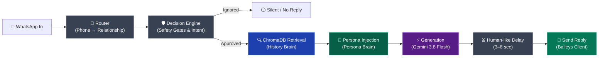

# 🚗 Put Your WhatsApp on Cruise Control
> **Hands-Free Replies by an AI Agent using Two-Brain RAG & Baileys**

An autonomous personal WhatsApp AI agent trained on your own chats that replies in your exact style: tone, Hinglish/slang, brevity, and relationship-specific communication rules.

---

## 🧠 Architecture Overview

The system uses a **Two-Brain Architecture** combined with deterministic safety gates:
1. **Persona Brain**: Represents who you are when texting (identity, tone, slang, emoji frequency per relationship).
2. **History Brain**: ChromaDB vector store indexing your real past WhatsApp conversation turns (`they said X` $\rightarrow$ `I replied Y`).



### 8 Pipeline Stages
1. **Message In**: Real incoming WhatsApp message captured via Baileys.
2. **Router**: Deterministic lookup table matching phone number to relationship (`friend`, `family`, `professional`, `group`, `unknown`).
3. **Decision Engine**: Layered checks:
   - *Hard Rules*: Ignore own messages, unknown senders, un-allowlisted groups.
   - *Signal Rules*: Ignore empty media, forwarded content, and single-word acknowledgments (`ok`, `cool`, `thanks`).
   - *Intent Check*: Gemini AI classifier flags sensitive queries (money, payments, serious emergencies) to ensure safe human-in-the-loop handling.
4. **Retrieval (History Brain)**: Queries `history_<relationship>` in ChromaDB for top-3 semantically similar dialogue turns using `paraphrase-multilingual-mpnet-base-v2`.
5. **Persona Injection (Persona Brain)**: Merges relationship tone and communication rules into the system prompt.
6. **Generation**: `gemini-3.8-flash` synthesizes an authentic reply matching the retrieved examples and user tone.
7. **Human-like Delay**: Waits 3–8 seconds before sending so replies feel natural rather than robotic.
8. **Send**: Dispatches the final message over WhatsApp via Baileys.

---

## 🛠️ Tech Stack

- **AI Model**: Google Gemini API (`gemini-3.8-flash`) via `google-genai`
- **Vector Database**: ChromaDB (persistent local vector store)
- **Embeddings**: `sentence-transformers` (`paraphrase-multilingual-mpnet-base-v2`)
- **Backend Bridge**: Python Flask API (`bridge.py`)
- **WhatsApp Web Client**: Node.js `@whiskeysockets/baileys` (`baileys_client.js`)
- **Dashboard & Console**: Streamlit (`app.py`, `console.py`)

---

## 🚀 Quickstart Guide

### 1. Prerequisites
- Python 3.10+
- Node.js 18+
- Gemini API Key ([Google AI Studio](https://aistudio.google.com/))

### 2. Setup Environment
```bash
# Clone the repository
git clone https://github.com/kasturimaheshbabu2316-mc/WhatsApp-on-Cruise-Control.git
cd "WhatsApp on Cruise Control"

# Install Python dependencies
pip install -r requirements.txt # or install flask streamlit chromadb sentence-transformers google-genai pytest streamlit-autorefresh

# Install Node.js dependencies
npm install
```

### 3. Configure `.env`
Create a `.env` file in the project root:
```env
GEMINI_API_KEY=your_gemini_api_key_here
GEMINI_MODEL=gemini-3.8-flash
```

### 4. Run the Pipeline

#### Terminal 1: Start Flask Bridge
```bash
python bridge.py
```
*Listens on `http://localhost:5001` and connects the Router, Decision Engine, ChromaDB, and Persona Generator.*

#### Terminal 2: Start Streamlit Dashboard
```bash
python -m streamlit run app.py
```
*Opens interactive Cruise Control Console at `http://localhost:8501` featuring the live decision stream, simulator, safety test suite, and ChromaDB retrieval inspector.*

#### Terminal 3: Connect Live WhatsApp
```bash
node baileys_client.js
```
*Scans QR code using a secondary WhatsApp account (**Settings → Linked Devices → Link a Device**). All incoming messages will be processed and logged in real-time.*

---

## ⚙️ Operating Modes

Controlled dynamically via `config/mode.txt` or through the Streamlit UI toggle:
- `DRY_RUN`: Simulates and logs all pipeline steps without sending real WhatsApp messages. (Default)
- `LIVE`: Actively dispatches autonomous WhatsApp replies to senders.

---

## 🧪 Testing

Run automated unit and integration tests:
```bash
python -m pytest test_bridge.py
python -m pytest agent/test_router.py
```

---

## 📁 Repository Structure

```
WhatsApp on Cruise Control/
├── agent/
│   ├── decision_engine.py    # Multi-layered safety gates & intent classification
│   ├── generator.py          # Persona prompt builder & Gemini reply synthesizer
│   ├── router.py             # JID relationship resolver
│   └── test_router.py        # Router test suite
├── ingestion/
│   ├── embed_to_chroma.py    # Vector ingestion pipeline
│   ├── parse_export.py       # WhatsApp chat export parser
│   └── retrieval.py          # Multilingual vector search
├── config/
│   ├── mode.txt              # Active mode: DRY_RUN or LIVE
│   └── relationship_map.json # Contact phone to relationship mappings
├── persona/
│   └── persona.json          # User identity, tone, and communication signals
├── logs/
│   ├── console_feed.jsonl    # Live decision stream audit log
│   └── decision_log.jsonl    # Historical decision gate logs
├── app.py                    # Complete Streamlit Cruise Control dashboard
├── console.py                # Standalone live feed viewer
├── bridge.py                 # Flask HTTP API webhook server
├── baileys_client.js         # Baileys WhatsApp client
└── test_bridge.py            # Bridge integration tests
```
